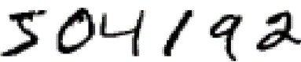
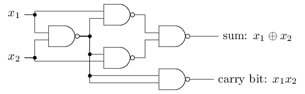
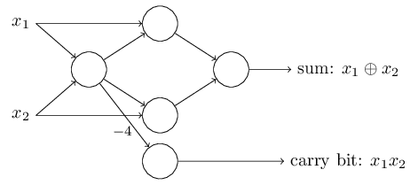
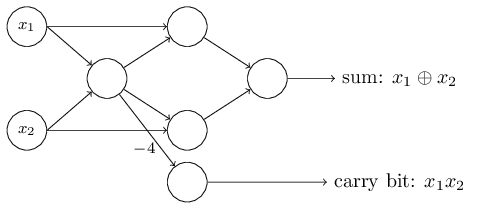
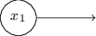
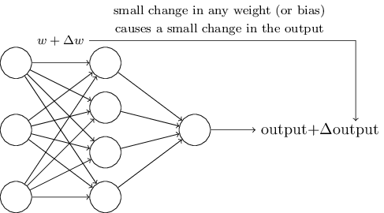
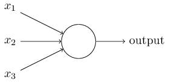

 [本书](http://neuralnetworksanddeeplearning.com/about.html)

神经网络和深度学习是一本免费的网络书。这本书将会教你这些：

- 神经网络，一个美丽的生物化编程形式，它使计算机能够用观测到的数据进行学习，进步。

- 深度学习，神经网络中用来进行学习的一堆强大方法技巧。

目前，神经网络和深度学习为图像处理、语音处理和自然语言处理中的许多问题提供了最好的解决方法。这本书将教你很多神经网络和深度学习背后隐藏的核心概念。

书中采用的那些方法的很多细节，[看这里](http://neuralnetworksanddeeplearning.com/about.html)。或者，你可以直接跳到第一章直接开始学习。

---

# 这本书讲的是什么
​	神经网络是有史以来最美丽的编程形式之一。传统的程序设计里，我们告诉电脑要做什么，又把一个大问题分成许多小的又精准定义的任务，让机器能很容易地运行。不同的是，在神经网络中，我们不用告诉电脑怎么解决我们的问题。反而是，它用观测到的数据进行学习，自己算出当前问题的解决方法。

​	用数据自主学习听起来很有发展力。然而，在2006年前，除了用它解决很少的专业问题外，我们还不知道如何去训练神经网络超越传统方法。2006年的转变是，在所谓的深度神经网络中，发现了进行学习的方法。这些方法就是我们现在熟知的深度学习。随后又进一步地开发了深度学习，当今的深度神经网络和深度学习在计算机视觉、语音识别和自然语言处理上的许多重要问题上取得了优异的成绩。像Google、Microsoft和Facebook这些公司，正在大规模使用它们。

​	这本书的目标是为了帮助你掌握神经网络的核心，包括潮流的深度学习技术。通过本书的练习，你将能够编写出使用神经网络和深度去解决复杂的模式识别问题。并且你将拥有了使用神经网络和深度学习解决自己设计的问题的基础。

## 以原则为导向的方法
​	本书的一个信念是最好对神经网络和深度学习的原理有一个扎实的了解，而不是对一连串的观念有个模糊的理解。如果你已经对核心观念又了很深的理解，你就可以很快地理解其他新的知识。用编程语言角度看，你可以认为是掌握一种新语言的核心语法，文件库和数据结构。你可能任然只知道整个语言里的一小部分---许多语言都有庞大的标准库---但是有了深刻的认识，新的库和数据结构就能很快很容易地理解。

​	这本书毫无疑问不是一个本教你如何使用某些特别的神经网络库的指导书。如果你主要是想用某个库学习你的东西，那么别阅读这本书！去找你想学习的库，通过指导和文档去练习它。但是需要注意。虽然这能及时解决问题。但如果你不去理解在神经网络里到底发生了什么，而如果你想拥有从现在起的几年内仍是有重要意义的原理，那么仅仅知识学习热门的库是不够的。你需要理解神经网络如何工作的本质，那些耐用而持久的原理。技术来了又走，但原理是永恒的。

​	我们将通过攻克一个具体的问题来学习神经网络和深度学习背后的核心原则， 这个问题是教会计算机识别手写数字。使用传统的编程方法是很难解决这个问题的。然而，我们将发现，用一个简单的神经网络就能很好地解决，程序代码也就几十行，也用不到什么库文件。另外，我们将通过多次迭代来改进程序，逐渐加入越来越多有关神经网络和深度学习的核心思想。

​	动手实践一位着读这本书你需要有一些编程的经验。但不要求你是个专业的程序员。我会用python2(版本2.7)来写代码，即使你不会python编程，只要稍加努力点也能很容易地理解它。通过本书的课程，我们将开发一个小型的神经网络库，你能够用它进行实验并建立理解。所有代码都能从[这里](https://github.com/mnielsen/neural-networks-and-deep-learning
)下载。一旦你看完了本书，又或你正在读它时，你能轻易地找到一个功能完备的神经网络库用在产品上。

​	在相关注释中，要适当地阅读本书的数学要求。大多章节都有一些数学，但通常是初等代数和函数块，我希望大多数读者能够接受它。我偶尔也会用许多高等数学，但知识都结构化了，所有你即使不理解一些数学细节，但你也能跟得上。[第2章](http://neuralnetworksanddeeplearning.com/chap2.html)广泛使用了大量的数学知识，这需要多元微积分和线性代数的知识。如果这些不是很熟悉，我在[第2章](http://neuralnetworksanddeeplearning.com/chap2.html)开头讨论了如何应对这些数学。如果你发现很难理解，你可以简单跳过本章主要结论的[总结](http://neuralnetworksanddeeplearning.com/chap2.html#the_backpropagation_algorithm)。无论如何，一开始都无需担心这个。

​	很少有本书的目标是既要面向原则又要动手实践。但我相信如果我们搭建好了神经网络的基本原理，你就能学得非常好。我们会开发实际的代码，而不是抽象的理论，你能够探究和扩展代码。通过理论与练习，你将理解基本原理，准备好进一步增加你的知识吧。

---

# 练习与问题

​	作者在技术书籍中告诫读者必须去做练习与问题，这一现象并不少见。每当我读到这样的告诫时，我总会有一点奇怪的感觉。如果我不去做练习和问题，将会有什么不好的事情发生呢？当然不会有。我会节省一笔时间，但代价却是对技术的理解程度。有时候这样做是值得的，但有时候并不值得。

​	所以本书中值得去做什么呢？我的建议是你应该尝试大量的练习，而不仅仅只是解决大量的问题。

​	你应该去做大量的练习，因为它们是基础，能够检测你对知识的理解程度。如果你无法轻松的解决一个问题，你可能遗漏了某些基础知识。如果你在某个练习上卡住了，继续学习下去——这可能是你对知识的理解出了点问题，又或者是我表达不清楚。但如果每个练习对你来说都是难题，那么你可能需要反复地去读先前的内容。

​	问题是另一回事。它们比练习难多了，你可能需要费很大的劲去解决一些问题。这真的烦人，但是，面对挫折需要又耐心。因为这是真正理解和融会贯通一个技术点的唯一方法。

​	顺便一提，我不建议解决所有的问题，最好是找到属于自己的项目。也许你想使用神经网络去分类你收藏的音乐，又或者预测股票，或其他什么。但*要找到一个你关心的项目* 。那么你就能忽略本书的问题，又或者把这些问题作为你自己项目的灵感。与你在意的项目做斗争，教你可不止是如何解决工作中一连串的问题。投入情感是实现技术精通的关键。

​	当然，至少在开始的时候，你心里也许还没有这样一个项目。那很好，解决你觉得工作上会遇到的问题。并通过书中的内容帮助你找到自己的项目创意。

---

# 第一章		使用神经网络去识别手写数字

---

​	人类视觉系统是世界奇迹之一。

​	请思考下面一组手写数字：

​	大都数人都能很容易地识别出这些数字是504192。这种轻松是骗人的。我们的大脑的两个半球都有初级视觉皮层，也称为V1，包含1.4亿个神经细胞，它们间有数百亿个链接。然而人类的视觉不仅仅涉及V1，还涉及到所有系列的视觉皮层——V2、V3、V4和V5——逐渐进行更加复杂的图像处理。我们头脑里的那台超级计算机，经过亿万年的进化调整，已经非常适应对图像世界的解析了。识别手写数字不是那么容易。当然，我们人类是非常惊人的，善于感知出眼睛给我们展现的东西。但几乎所有事情都是在不知不觉中完成的。所以我们通常都不知道我们的视觉系统处理的问题是多么的困难。

​	如果你试图写一个程序来识别上面那些数字，那么视觉模式识别的困难就体现出来了。看似容易的事，当我们自己做的时候就突然变得非常难了。我们对形状的识别，直观上是——“一个9，顶部一个圈，右下角是一竖”——但用算法却不是那么容易表达的。当你试图用这样的规则去校准时，你很快就会陷入一个充满异常，警告和特殊情况的泥潭中。似乎没什么指望了。

​	神经网络用一种不同的方式来解决问题。方法要采用大量的手写数字，即训练实例，

然后开发一个能够从这些训练实例中学习的系统。换句话说，就是，神经网络使用这些例子能自动地推衍出识别手写数字的规则。此外，通过增加训练实例的数量，神经网络能够学习更多的手写字体，从而提高它的精确度。因此，虽然我在上面只展现了100个训练数字，但也许我们可以使用百万或数十亿的训练实例来构建一个更好的手写识别系统。

​	在这章里，我们将写一个程序来实现一个通过学习来识别手写数字的神经网络。这个程序也仅仅只有74行，而且没有使用任何的神经网络库。但如此短的程序在没有人的干涉下，却有高达96%的精确度。此外，在后面的章节中，我们将实现可以把精确度提高到超过99%的想法。实际上，最好的商业神经网络现在十分好用，以至于被银行用来处理发票，被邮局用来识别地址。

​	总而言之，我们关注手写识别是因为它是学习神经网络的一个很好的原型问题。作为一个蓝本，它符合了一个非常棒的：它具有挑战性——识别手写数字是个不小的壮举——但它又不是特别困难，不要求一个极其复杂的解决方案，又或巨大的计算能力。此外，它是一个开启更多先进技术的好方式，如深度学习。本书中我们将不断重复手写识别这个问题。本书的后面，我们将讨论如何把这些创意应用到计算机视觉领域的其他问题上，或者其他领域。

​	当然，如果这章的关键点仅仅是写一个识别手写数字的程序，那么这章将会非常的短！但是在写程序的过程中，我们将发现许多神经网络的核心思想，包括两个重要的人工神经类型（perceptron 和 sigmoid neuron），和神经网络的标准化学习算法，即随机梯度下降。经深思熟虑后，我关注于解释为什么用这样的方法来做，和关于建立你神经网络的思考直觉。这花费的时间比我仅仅只提出基础的运行原理要多得多，但这是值得的，你会得到更深层次的理解。在本章的末尾，我们将了解什么是深度学习，为什么它这么重要。

## Perceptrons  (感知器)

---

​	什么是神经网络？在开始接触时，我会解释一种叫感知器的人工神经元。感知器是20世纪50年代到60年代的一个叫Frank Rosenblatt的科学家研发的，他的灵感来自于Warren McCulloch和Walter Pitts的早期研究。今天，使用人工神经元模型非常常见——在这本书中，使用神经网络的现代工作中，其中主要使用的是一个叫做sigmoid神经元的神经元模型。我们马上就会接触到sigmoid神经元。但为了理解sigmoid神经元为什么是那样子定义的，那么就值得先花时间去理解感知器。

​	那么感知器是如何工作的呢？一个感知器有很多个二进制输入端口,$x_1, x_2, ..., $但仅有一个二进制输出端口：

​	在这个图中所展示的感知器有三个输入端，$x_1, x_2, x_3$。一般来说输入端可以很多，也可以很少。Rosenblatt这个人为了计算输出值提出了一个简单的规则。他提出了 *weights(权重)* 这个值，$w_1, w_2,...$,这些数值是用来表示各个输入对输出的重要性。神经元的输出要么是0，要么是1，该值取决于 *加权的总和*  $ \sum_j w_jx_j $ 与*threshold value(阈值)* 之间的大小关系。同权重一样，阈值这个数值也是神经元的一个参数。更精确的数学表达式如下：
$$
output = \begin{cases} 0 \quad if \sum_jw_jx_j\leq threshold(阈值) \\ 1 \quad if \sum_jw_jx_j > threshold(阈值) \end{cases}
$$
​	这就是感知器的工作原理！

​	这就是最基础的数学模型。在某方面，你可以认为感知器就是一种综合各种因素来做出决定的东西。让我举个简单的例子。虽然这个例子不是真实的，但很容易理解，当然，我们之后会接触更多实际的例子。假设周末快要到来了，听说你的城市将会举办一场奶酪节。你很喜欢奶酪，所以正纠结是去还是不去参加这个节日。你也许会考虑以下三种因素来做出你的选择：

 	1. 天气好吗？
 	2. 你的男朋友或着女朋友想跟你一块去吗？
 	3. 节日地点靠近公交站吗？（你没有私家车）

​	我们可以用对应的二进制$x_1,x_2和x_3$来表示三种因素。例如，如果天气好，就有$x_1 = 1$，如果天气不好，则$x_1 = 0$。同样的，如果你男朋友或女朋友想去, 那么$x_2 = 1$， 否则$x_2 = 0$。$x_3$与交通因素的关系同样如此。

​	现在，假设你热衷于奶酪，所以即便是你的男朋友或女朋友对此没兴趣且节日地点很难到达，你都乐意去参加节目。但你特别讨厌坏天气。你可以使用感知器来模拟这种决策。一种方法是设置一个与天气有关的权重$w_1$为6，而其他因素的权重$w_2=2, w_3=2$。较大的$w_1$值表明了天气对你的重要性，它的重要性远远超出了你男朋友或女朋友是否与你一起去的重要性，和交通远近因素的重要性。最后，假设你把感知器的阈值设置为了5。通过这些选择，感知器实现了所期望的决策模式，当天气是好时输出为1， 而天气坏时输出为0。但是它不会因为你的男朋友或女朋友想不想去，又或公交站远不远而做出不同的输出。

​	通过改变各个输入的权重和阈值，我们能够得到不同的决策模式。例如，假设我们把阈值设置为3。那么当天气好时，又或者当节日地点离车站近且你男朋友或女朋友想跟你一块去时，决策模型就会做出你会去的决定。换句话说，它就是一个不同的决策模式。阈值越低，意味着你越想去参加节目。

​	很显然，感知器不是人类决策的完整模式。但是这个例子说明了一个感知器时如何综合各种因素来做出决定的。一个复杂的感知网络似乎能够合理地做出很多非常巧妙的决定：

​	对上面的感知网络，我们把第一列的感知器称为第一层感知器，它通过权衡所有的输入值来做出三个非常简单的答案。那么第二层感知器呢？第二层的每个感知器通过权衡第一层的所有决策结果做出一个决定。通过这种方式，第二层的每个感知器都能做出一个比第一层更复杂，更抽象的决定。用这样的方法，多层感知网络就能够从事复杂的决策。

​	顺便说一下，我定义感知器时，我曾说过一个感知器仅仅只有一个输出。上图中，感知网络上的第一层感知器，看起来每个似乎都有很多的输出。事实上，他们然是都是同一个输出值。画出多个输出端仅仅是便于说明该感知器输出是其他多个感知器的输入。它比绘制一个输出端后再分开画几个输入端好看多了。

​	让我们简化一下描述感知器的数学公式。$\sum_j w_jx_j > 阈值$这个条件看起来很复杂，我们进行两次符号变换来简化这个不等式。第一次变换是把$\sum_j w_jx_j$写成点积式，即$w · x \equiv \sum_j w_jx_j$,其中w和x分别是权重和输入值的向量。第二次变换是把阈值移到不等式的另一边，然后用bias来代替阈值，即$b \equiv -threshold(-阈值)$。使用bias代替threshold，感知器的公式重写为：
$$
output = \begin{cases} 0 & if w·x \leq 0 \\ 1 & if w·x < 0\end{cases}
$$
​	你可以把bias认为是感知器输出1的容易程度。从生物角度上讲，bias是感知器兴奋的容易程度。一个bias很大的感知器是很容易输出1的。但如果bias很小的话，感知器是很难输出1的。很显然，我们引入的bias是描述感知器的一个小小的变化，但值后我们会看到用bias会进一步地进行符号简化。因此，本书的后续部分，我们不再使用阈值了，而是使用bias这个值。

​	我将感知器的功能描述成权衡事件因素来做出决定。感知器的另外一个用途是实现基本逻辑运算，如AND, OR，和NAND。例如，假设我们有一个有着两个输入端，且输入值的权重都为-2，bias为3的感知器。感知器如下：

​	然后我们发现，输入00会输出1，因为$(-2)*0 + (-2)*0 + 3 = 3$ 结果是正数，由感知器公式可知输出1。这里的$*$符号是乘法符号。类似的计算，输入01和10都输出1。但如果输出11那么就会输出0， 因为$(-2)*1 + (-2)*1 + 3 = -1$结果为负数。所以这个感知器实现了一个NAND门。

​	这个模拟NAND门例子说明了我们能够使用感知器来实现简答的逻辑运算。事实上，我们可以使用感知网络实现所有的逻辑运算。因为NAND(与非)门是通用的逻辑运算，任何计算都能用与非门实现。例如，我们使用与非门实现一个两位相加的电路，$x_1和x_2$。电路要求计算位的和,$x_1 \oplus x_2$，以及一个进位，当$x_1和x_2$都为1时进位为1。进位是由位运算$x_1x_2$实现的：

​	为了得到一个等价的感知网络，我们把与非门都用感知器代替，该感知器有两个输入端，每个权重都为-2，且bias为3。下图就是最终的感知网络。注意，我把电路图中右下角与非门对应的感知器移动了一下，这样做只是为了在图中方便画箭头而已：

​	该感知网络值得注意的一点是，最左边的感知器的输出调用了两次作为最下面感知器的输入。我定义感知器的时候，并未说过多个输出到同一个地方是不允许的。事实上，这也没什么大不了的。如果我们不想这样做，那么可以把最底部的感知器的两个输入简单地合成一个输入，原本两个输入权重都为-2，现在变成了一个拥有权重为-4的输入了。（如果你想不通为什么这样，你可以停下来证明这一点。）改变后，网络结构看起来如下图，没有标记的权重都为-2，所有的bias都为3, 一个标记为-4的权重：

​	到现在为止，我一直在感知网络左边画两个$x_1和x_2$变量做输入值。事实上，按照惯例，我们会画一个额外的感知层——输入层——用来对这些输入进行编码：

​	值得注意的是，输入感知器只有输出，没有输入，是一个简化版感知器。

​	并不是真的意味着感知器没有输入。为了解释这个，假设我们有一个没有输入的感知器。那么权重和$\sum_j w_jx_j$将总是为0，所以感知器的输出由bias决定，当b>0时，输出1，当b$\leq$0时，输出为0。这样的话，感知器将会简单地输出一个固定的值，而不是期望的值(上面例子中的$x_1$)。最好不要把输入感知器看作一个真的感知器，而应视作为一个被简单定义为输出期望值，$x_1，x_2,...$的特殊单元。

​	加法器的例子展示了一个感知网络是怎样模拟一个由与非门组成的电路。因为与非门是通用的逻辑运算，由此得出，感知器也是通用的逻辑运算。

​	感知器的通用性让人即欣慰又失望。欣慰是因为感知网络可以像其他计算设备那样强大。但失望的是，它似乎也仅仅只是一个新型的与非门。这没什么大不了的！

​	然而，情况比看起来的要好。事实表明，我们可以设计出能自动调整人工神经网络的权重和bias值的*学习算法(learning algorithms)*。这种调整是在没有人工直接干涉的外部刺激下发生的。这些学习方法让我们能够用一种完全不同于传统逻辑门的方式来使用人工神经元。感知网络不是明确的电路，而是能够简单地学习去解决问题，有的是那些传统电路很难解决的问题。

## Sigmoid neurons

---

​	学习算法(Learning algorithms)听起来特别厉害。但是我们该如何设计神经网络的这种算法呢？假设我们有了一个用于学习解决某些问题的感知网络。举个例子，输入到神经网络的值，也许是扫描得到的手写数字照片的原始像素数据。我们想要神经网络能够通过学习去调整权重和bias，使得神经网络输出的结果能够正确地分辨照片。为了看到神经网络的学习是如何实现的，假设我们对神经网络的某些权重(或bias)做了一个小小的变化。我们想要的情况是，神经网络仅仅因为权重(或bias)的这个细微的变化，就会导致输出的结果发生一个相应的细微变化。待会我们就能看到，这个特性将会让神经网络的学习变成可能。下图就是我们想要的东西（很显然，这个神经网络实在是太简陋了，不能作为手写识别！）：

​	如果一个权重(或bias)细微的变化，就会导致输出发生细微的变化这个条件是真的存在，那么我们可以使用这一事实去修改权重和bias，那么神经网络就会按照我们期望的方式做事。例如，假设神经网络把图像上的数字“9”错误地识别为了“8”。我们可以计算出，在权重和bias上做出多大的变化，就能够让神经网络的结果向识别为“9”的程度靠近。然后我们重复上述的操作，不断地改变权重和bias，输出的结果就会越来越精确。这个神经网络就是在不断地学习。

​	问题是上述理想的微调效果不会发生在含有感知器的神经网络上。事实上，对神经网络上的任意一个感知器的权重或bias进行一个微小的变化时，有时会导致感知器的输出结果完全相反，也就是说0会变成1。这种相反的结果可能会导致网络上的其他部分发生非常复杂的变化。比如当数字“9”现在能够正确识别出来了，但网络对其他数字图像的识别结果可能会向着难以控制的方向发生改变。这使我们很难通过逐步调整权重和bias的方法让神经网络接近期望的结果。也许会有更聪明的方式。但在我们学习感知网络时不是那么容易发现的。

​	通过引入一个叫*sigmoid*的新型人工神经元，我们能够克服这个问题。sigmoid神经元与感知器很像 ，但经修改后，权重和bias的微小改变只会对输出造成微小的影响。这是让sigmoid神经网络能够自主学习的关键。

​	好了，让我描述sigmoid神经元吧。我们用画感知的方式来画sigmoid神经元：

​	sigmoid的输入值,$x_1,x_2...$看起来跟感知器的一模一样。但这不是0或1，这些输入也可以是0到1之间的任何数值。比如说0.638.....是一个输入到sigmoid神经元的值。sigmoid神经元的每个输入都有权重，$w_1, w_2, ...$,也有一个bias，即b，这也跟感知器看起来一样。但输出不是0或1。而是，$\sigma(w·x + b)$，这里的$\sigma$叫做sigmoid函数，该函数的定义如下：

​	(*顺便说下，*$\sigma$*有时被叫做逻辑[logistic]函数，这个新类别的神经元被称为逻辑[logistic]神经元。记住这个术语很有用，因为这些术语被许多从事神经网络的人使用过。然而，我们坚持使用sigmoid这个术语*)
$$
\sigma(z) = \frac{1}{1+e^{-z}}
$$
​	有着输入$x_1,x_2,...$，权重$w_1, w_2, ...$和一个b(bias)，的sigmoid神经元，其更详细的输出结果如下：
$$
\frac{1}{1+exp(-\sum_j w_jx_j - b)}
$$
​	乍一看，sigmoid神经元跟感知器区别特别大。如果你不熟悉sigmoid函数，就会就觉得sigmoid函数的代数公式晦涩难懂。实际上，感知器和sigmoid神经元之间有很多相似之处，sigmoid函数的代数公式，更多的是技术细节上的差异，而不是本质的差异。

​	为了说明sigmoid神经元与感知器的相似性，假设$z\equiv w·x + b$是一个很大的正数。那么$e^{-z}  \approx 0$，故$\sigma(z) \approx 1$。也就是说，当$z = w·x + b$是个很大的正数时，sigmoid神经元的输出将近似于1，就像感知器结果为正输出1一样。相反，假设$z=w·x + b$是一个很大的负数。那么$e^{-z} \rightarrow \infty$，故$\sigma(z) \approx 0$。所以当$z=w·x + b$是个很大的负数时，sigmoid的输出结果也很接近感知器的输出结果。只有当$w·x + b$的适中时，与感知器的输出才有很大的偏差。

​	